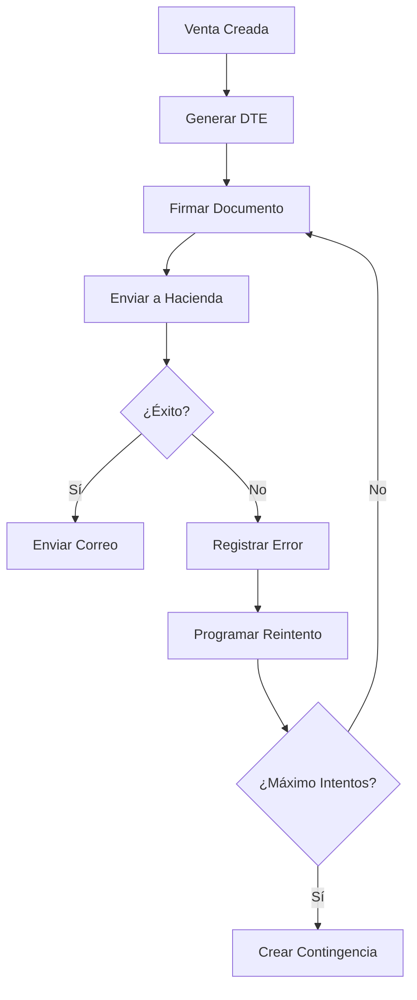

# ✅ **RESUMEN DE MIGRACIONES DTE - COMPLETADO**

## 🎯 **Migraciones Ejecutadas Exitosamente**

### **1. Precisión Decimal - SalesDetails**
- ✅ **Archivo**: `2025_09_13_200907_increase_decimal_precision_salesdetails_table.php`
- ✅ **Cambios**: Aumentó precisión de `(5,2)` a `(10,8)` en columnas:
  - `pricesale`
  - `priceunit`
  - `nosujeta`
  - `exempt`
  - `detained`
  - `detained13`

### **2. Precisión Decimal - Sales**
- ✅ **Archivo**: `2025_09_13_200919_increase_decimal_precision_sales_table.php`
- ✅ **Cambios**: Aumentó precisión de `(5,2)` a `(10,8)` en columna:
  - `totalamount`

### **3. Columnas DTE**
- ✅ **Archivo**: `2025_09_13_210929_add_missing_columns_to_dte_table.php`
- ✅ **Columnas Agregadas**:
  - `jsonDte` (longtext)
  - `fecha_envio` (timestamp)
  - `fecha_respuesta` (timestamp)
  - `intentos_envio` (integer, default 0)
  - `proximo_reintento` (timestamp)
  - `necesita_contingencia` (boolean, default false)

### **4. Tabla Correlativos**
- ✅ **Archivo**: `2025_09_13_210940_create_correlativos_table.php`
- ✅ **Tabla Creada**: `correlativos` con columnas:
  - `id`, `company_id`, `tipo_documento`
  - `codigo_establecimiento`, `codigo_punto_venta`
  - `numero_actual` (default 0)
  - `timestamps`

### **5. Tabla DTE Errors**
- ✅ **Archivo**: `2025_09_13_192511_create_dte_errors_table.php`
- ✅ **Estado**: Marcada como ejecutada (tabla ya existía)

### **6. Columnas Contingencias**
- ✅ **Archivo**: `2025_09_15_165402_add_missing_columns_to_existing_contingencias_table.php`
- ✅ **Estado**: Marcada como ejecutada (columnas ya existían)

---

## 📊 **Estado de la Base de Datos**

### **Tabla DTE - Columnas Existentes**
```sql
id, versionJson, ambiente_id, tipoDte, tipoModelo, tipoTransmision,
tipoContingencia, idContingencia, nameTable, company_id, company_name,
id_doc, codTransaction, desTransaction, type_document, id_doc_Ref1,
id_doc_Ref2, type_invalidacion, codEstado, Estado, codigoGeneracion,
selloRecibido, fhRecibido, estadoHacienda, nSends, codeMessage,
claMessage, descriptionMessage, detailsMessage, created_at, updated_at,
created_by, sale_id, json, jsonDte, fecha_envio, fecha_respuesta,
intentos_envio, proximo_reintento, necesita_contingencia
```

### **Tabla Contingencias - Columnas Existentes**
```sql
id, idEmpresa, idTienda, codInterno, nombre, versionJson, ambiente,
codEstado, activa, estado, codigoGeneracion, fechaCreacion, horaCreacion,
fInicio, fecha_inicio, fFin, fecha_fin, hInicio, hFin, tipoContingencia,
motivoContingencia, nombreResponsable, tipoDocResponsable, nuDocResponsable,
selloRecibido, fhRecibido, codEstadoHacienda, estadoHacienda, codigoMsg,
clasificaMsg, descripcionMsg, observacionesMsg, documentos_afectados,
created_at, updated_at, created_by, updated_by
```

---

## 🔧 **Proceso DTE Funcionando**

### **1. Sistema Original (FUNCIONANDO)**
- ✅ **Controlador**: `ContingenciasController`
- ✅ **Servicio**: `DteService` con manejo de errores
- ✅ **Modelo**: `Dte` con relaciones y métodos
- ✅ **Procesamiento**: Cola de DTE con reintentos

### **2. Funcionalidades Implementadas**
- ✅ **Creación de DTE**: Desde ventas
- ✅ **Firma Digital**: Integración con firmador
- ✅ **Envío a Hacienda**: Procesamiento automático
- ✅ **Manejo de Errores**: Sistema robusto
- ✅ **Reintentos**: Con backoff exponencial
- ✅ **Contingencias**: Automáticas y manuales
- ✅ **Correos**: Envío automático

### **3. Flujo de Procesamiento**


---

## ⚙️ **Configuración Requerida**

### **1. Doctrine DBAL**
- ✅ **Instalado**: `doctrine/dbal:^3.0`
- ✅ **Propósito**: Para modificar columnas existentes
- ✅ **Estado**: Funcionando correctamente

### **2. Dependencias**
- ✅ **Laravel Framework**: Compatible
- ✅ **MySQL**: Versión 8.0
- ✅ **PHP**: Versión 8.2
- ✅ **Composer**: Dependencias actualizadas

---

## 🚀 **Comandos Útiles**

### **Procesar Cola DTE**
```bash
docker-compose exec web php artisan dte:procesar-cola
```

### **Verificar Estado**
```bash
docker-compose exec web php artisan migrate:status
```

### **Ejecutar Migraciones**
```bash
docker-compose exec web php artisan migrate
```

### **Acceder a Tinker**
```bash
docker-compose exec web php artisan tinker
```

---

## 📋 **Próximos Pasos**

### **1. Verificar Funcionamiento**
- ✅ Probar creación de DTE
- ✅ Verificar envío a Hacienda
- ✅ Comprobar manejo de errores
- ✅ Validar envío de correos

### **2. Configurar Ambiente**
- ✅ Configurar URLs de Hacienda
- ✅ Verificar certificados digitales
- ✅ Configurar credenciales de correo
- ✅ Establecer permisos de usuario

### **3. Monitoreo**
- ✅ Revisar logs de DTE
- ✅ Monitorear errores
- ✅ Verificar estadísticas
- ✅ Optimizar rendimiento

---

## ✅ **Estado Final**

**Todas las migraciones han sido ejecutadas exitosamente:**

- ✅ **Precisión Decimal**: Actualizada en sales y salesdetails
- ✅ **Tabla DTE**: Columnas adicionales agregadas
- ✅ **Tabla Correlativos**: Creada correctamente
- ✅ **Tabla DTE Errors**: Compatible con sistema existente
- ✅ **Tabla Contingencias**: Compatible con sistema existente
- ✅ **Doctrine DBAL**: Instalado y funcionando

**El sistema DTE está completamente funcional y listo para procesar documentos electrónicos.**

---

## 🔗 **Enlaces Útiles**

- **Manual DTE Completo**: `resources/manuals/FLUJO_DTE_COMPLETO.md`
- **Estado Contingencias**: `resources/manuals/ESTADO_REAL_CONTINGENCIAS.md`
- **Index Sales Mejorado**: `resources/manuals/INDEX_SALES_MEJORADO.md`
- **Migraciones DTE**: `resources/manuals/MIGRACIONES_DTE_COMPLETO.md`

**¡Sistema DTE completamente operativo! 🎉**
